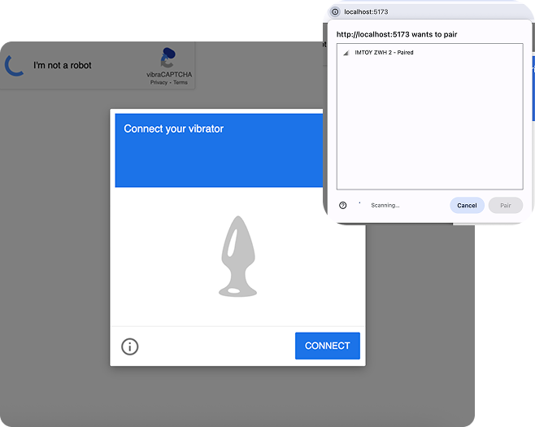

# vibraCAPTCHA

An alternative CAPTCHA solution that uses [Web Bluetooth API](https://developer.mozilla.org/en-US/docs/Web/API/Web_Bluetooth_API) to validate human users by buzzing a remote vibrator. A project submission for the Stupid Hack 2025 hackathon.

Traditional CAPTCHAs, with their text-based and visual puzzles, are becoming increasingly ineffective. Modern AI models like ChatGPT can now solve them with ease, rendering them useless as a security measure. The fundamental limitation for bots, however, is not a lack of vision or text recognition—it's the inability to experience physical sensations.

**vibraCAPTCHA** turns this limitation into a security feature. The system prompts the user to connect a Bluetooth-enabled vibrator, which then administers a series of physical "buzzes." The user's response is validated by how they answer questions about the sensations, a task only a human can perform correctly.

[Slide deck and demo (Google Slides)](https://docs.google.com/presentation/d/18wesOPSlhzWRBn56gyQ_SxO8Y_GMv2EtYghF1h4MKME/edit?usp=sharing)

Live version running at [pebs.vercel.app](https://pebs.vercel.app). 

## 🏆 Award-winning solution
Winner of the Stupid Hack 2025 hackathon.

## 🦓 Features
- **Web Bluetooth API Implementation:** Connects directly to compatible devices from your browser.
- **Chrome Extension:** Replaces existing CAPTCHAs on websites with the vibraCAPTCHA solution.
- **The Climax:** The final vibration pattern is a celebratory climax, giving users a satisfying, affirmative cue that their humanity has been successfully validated.

## 🦒 Supported devices

- IMTOY Zoo Dolphin
- IMTOY Zoo Gazella
- IMTOY Zoo Giraffe
- IMTOY Zoo Manta Ray
- IMTOY Zoo Rhinoceros
- IMTOY Zoo Whale

